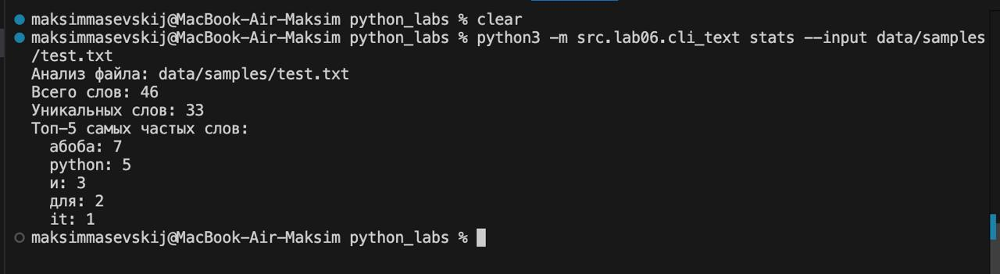
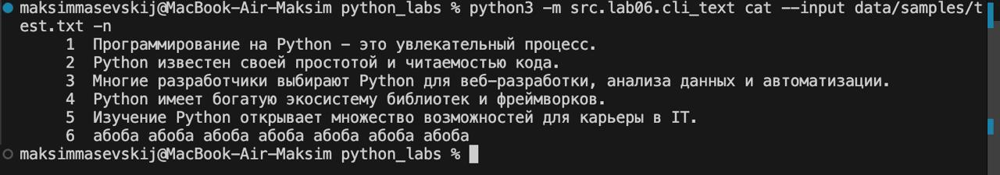
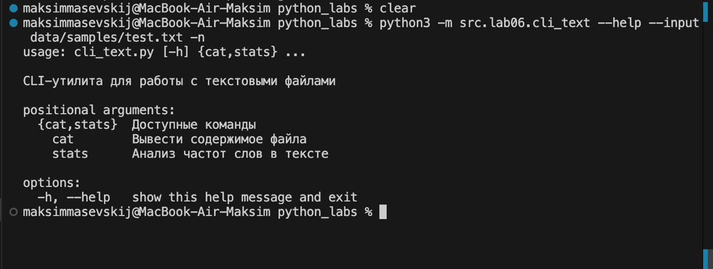
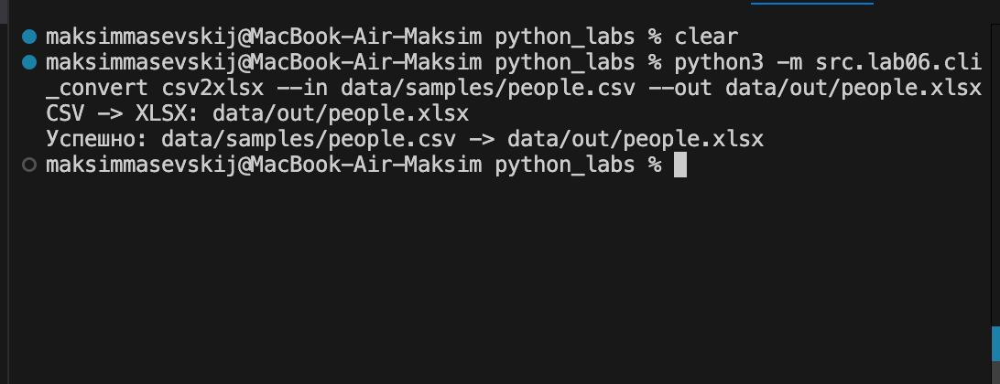
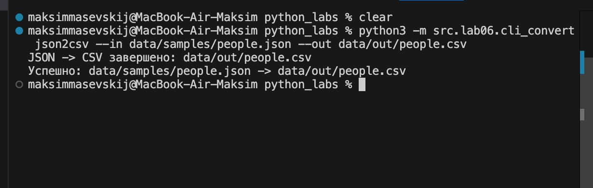
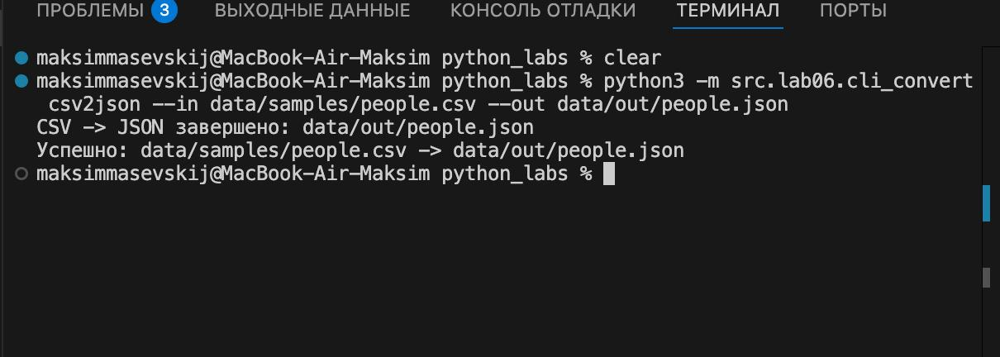
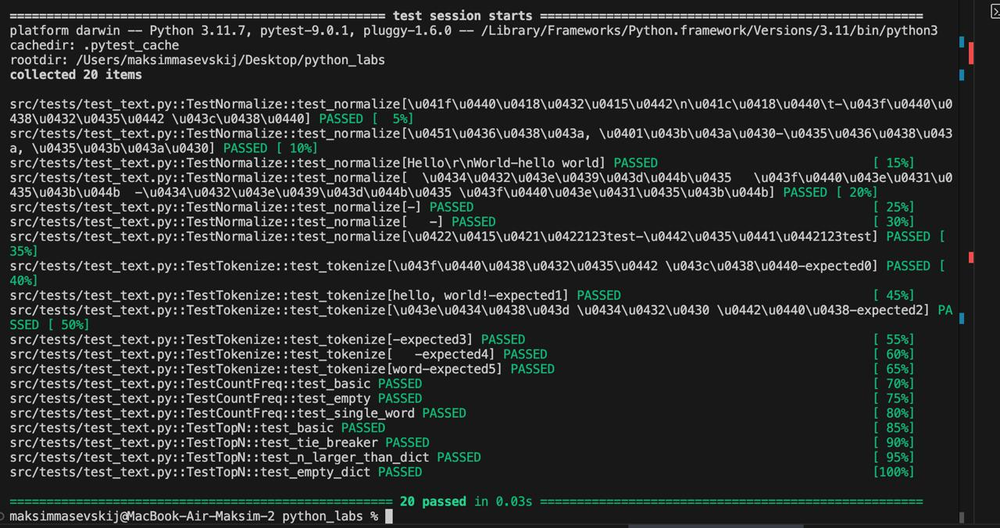
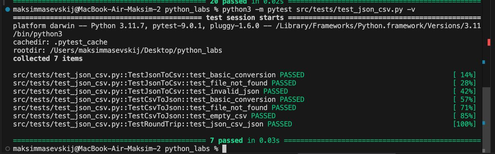
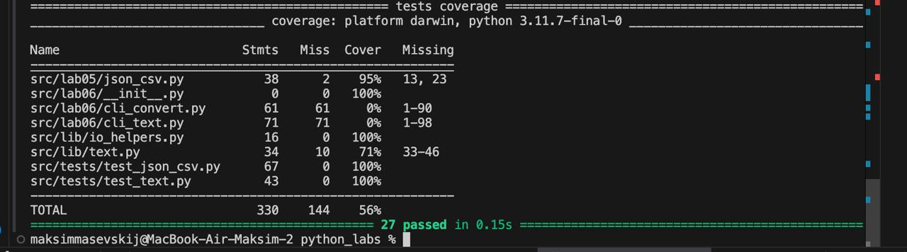
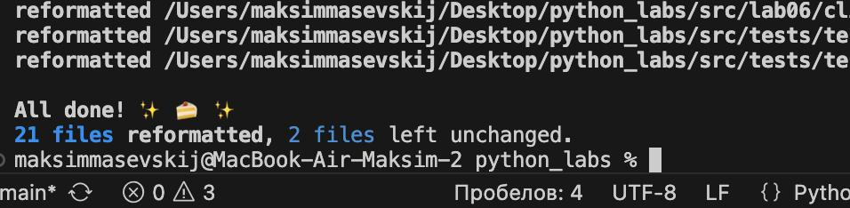

<h1>Python_Labs</h1>

# Лабораторная работа 6

## Модуль cli_text.py - работа с текстом
### Команда: stats
### Описание: Анализ частот слов в текстовом файле
```python
python3 -m src.lab06.cli_text stats --input data/samples/test.txt
```
### Вывод консоли


### Команда: cat
### Описание: Вывод содержимого файла с опциональной нумерацией

```python
python3 -m src.lab06.cli_text cat --input data/samples/test.txt -n
```


### Команда: --help
### Описание: Помошник по работе с командой

```python
python3 -m src.lab06.cli_text --help --input data/samples/test.txt -n
```


## Модуль cli_convert.py - работа с текстом
### Команда: csv2xlsx

### Описание: Конвертирует CSV файл в XLSX формат (Excel)

```python
python3 -m src.lab06.cli_convert csv2xlsx --in data/samples/people.csv --out data/out/people.xlsx
```


### Команда: json2csv

### Описание: Конвертирует JSON файл в CSV формат

```python
python3 -m src.lab06.cli_convert json2csv --in data/samples/people.json --out data/out/people.csv
```


## Команда: csv2json

## Описание: ККонвертирует CSV файл в JSON формат
```python
python3 -m src.lab06.cli_convert csv2json --in data/samples/people.csv --out data/out/people.json
```


## cli_convert.py
```python
import argparse
import os
import sys

# Прямое добавление пути к lab05
sys.path.append(os.path.join(os.path.dirname(__file__), '..', 'lab05'))

try:
    import csv_xlsx
    import json_csv
except ImportError as e:
    print(f"Ошибка импорта: {e}")
    sys.exit(1)

def validate_file_extension(filename, allowed_extensions):
    """Проверяет, что файл имеет одно из разрешенных расширений"""
    file_ext = os.path.splitext(filename)[1].lower()
    if file_ext not in allowed_extensions:
        raise ValueError(f"Файл должен иметь одно из расширений {allowed_extensions}: {filename}")

def validate_json2csv_files(input_file, output_file):
    """Проверяет форматы файлов для конвертации JSON в CSV"""
    validate_file_extension(input_file, ['.json'])
    validate_file_extension(output_file, ['.csv'])

def validate_csv2json_files(input_file, output_file):
    """Проверяет форматы файлов для конвертации CSV в JSON"""
    validate_file_extension(input_file, ['.csv'])
    validate_file_extension(output_file, ['.json'])

def validate_csv2xlsx_files(input_file, output_file):
    """Проверяет форматы файлов для конвертации CSV в XLSX"""
    validate_file_extension(input_file, ['.csv'])
    validate_file_extension(output_file, ['.xlsx'])

def main():
    parser = argparse.ArgumentParser(
        description="CLI-конвертер данных между форматами JSON, CSV и XLSX",
        formatter_class=argparse.RawDescriptionHelpFormatter
    )
    subparsers = parser.add_subparsers(dest="command", help="Доступные команды конвертации")

    # Подкоманда json2csv
    json2csv_parser = subparsers.add_parser("json2csv", help="Конвертировать JSON в CSV")
    json2csv_parser.add_argument("--in", dest="input", required=True, help="Входной JSON файл")
    json2csv_parser.add_argument("--out", dest="output", required=True, help="Выходной CSV файл")

    # Подкоманда csv2json
    csv2json_parser = subparsers.add_parser("csv2json", help="Конвертировать CSV в JSON")
    csv2json_parser.add_argument("--in", dest="input", required=True, help="Входной CSV файл")
    csv2json_parser.add_argument("--out", dest="output", required=True, help="Выходной JSON файл")

    # Подкоманда csv2xlsx
    csv2xlsx_parser = subparsers.add_parser("csv2xlsx", help="Конвертировать CSV в XLSX")
    csv2xlsx_parser.add_argument("--in", dest="input", required=True, help="Входной CSV файл")
    csv2xlsx_parser.add_argument("--out", dest="output", required=True, help="Выходной XLSX файл")

    args = parser.parse_args()

    try:
        if args.command == "json2csv":
            validate_json2csv_files(args.input, args.output)
            json_csv.json_to_csv(args.input, args.output)
            print(f"Успешно: {args.input} -> {args.output}")
            
        elif args.command == "csv2json":
            validate_csv2json_files(args.input, args.output)
            json_csv.csv_to_json(args.input, args.output)
            print(f"Успешно: {args.input} -> {args.output}")
            
        elif args.command == "csv2xlsx":
            validate_csv2xlsx_files(args.input, args.output)
            csv_xlsx.csv_to_xlsx(args.input, args.output)
            print(f"Успешно: {args.input} -> {args.output}")
            
        else:
            parser.print_help()
            
    except FileNotFoundError as e:
        print(f"Ошибка: Файл не найден - {e}", file=sys.stderr)
        sys.exit(1)
    except ValueError as e:
        print(f"Ошибка: Неверные данные или формат файла - {e}", file=sys.stderr)
        sys.exit(1)
    except Exception as e:
        print(f"Неожиданная ошибка: {e}", file=sys.stderr)
        sys.exit(1)

if __name__ == "__main__":
    main()
```
## cli_text.py
```python
import argparse
import os
import sys

sys.path.append(os.path.join(os.path.dirname(__file__), '..', 'lab03'))

from text import normalize, tokenize, count_freq, top_n

def validate_txt_file(filename):
    """Проверяет, что файл имеет расширение .txt"""
    if not filename.lower().endswith('.txt'):
        raise ValueError(f"Файл должен иметь расширение .txt: {filename}")

def cat_command(input_file, number_lines=False):
    try:
        validate_txt_file(input_file)
        
        with open(input_file, 'r', encoding='utf-8') as file:
            lines = file.readlines()
            
        for i, line in enumerate(lines, 1):
            if number_lines:
                print(f"{i:6d}\t{line.rstrip()}")
            else:
                print(line.rstrip())
                
    except FileNotFoundError:
        raise FileNotFoundError(f"Файл не найден: {input_file}")
    except Exception as e:
        raise Exception(f"Ошибка при чтении файла: {e}")

def stats_command(input_file, top_count=5):
    try:
        validate_txt_file(input_file)
        
        with open(input_file, 'r', encoding='utf-8') as file:
            text = file.read()
        
        if not text.strip():
            raise ValueError('Файл пуст')
        
        # Используем функции из lab03
        normalized_text = normalize(text, casefold=True, yo2e=True)
        tokens = tokenize(normalized_text)
        total_words = len(tokens)
        unique_words = len(set(tokens))
        freq = count_freq(tokens)
        top_words = top_n(freq, top_count)
        
        print(f"Анализ файла: {input_file}")
        print(f"Всего слов: {total_words}")
        print(f"Уникальных слов: {unique_words}")
        print(f"Топ-{top_count} самых частых слов:")
        for word, count in top_words:
            print(f"  {word}: {count}")
            
    except FileNotFoundError:
        raise FileNotFoundError(f"Файл не найден: {input_file}")
    except Exception as e:
        raise Exception(f"Ошибка при анализе текста: {e}")

def main():
    parser = argparse.ArgumentParser(
        description="CLI-утилита для работы с текстовыми файлами",
        formatter_class=argparse.RawDescriptionHelpFormatter
    )
    subparsers = parser.add_subparsers(dest="command", help="Доступные команды")

    cat_parser = subparsers.add_parser("cat", help="Вывести содержимое файла")
    cat_parser.add_argument("--input", required=True, help="Входной файл")
    cat_parser.add_argument("-n", action="store_true", help="Нумеровать строки")

    stats_parser = subparsers.add_parser("stats", help="Анализ частот слов в тексте")
    stats_parser.add_argument("--input", required=True, help="Входной текстовый файл")
    stats_parser.add_argument("--top", type=int, default=5, help="Количество топ-слов (по умолчанию: 5)")

    args = parser.parse_args()

    try:
        if args.command == "cat":
            cat_command(args.input, args.n)
        elif args.command == "stats":
            stats_command(args.input, args.top)
        else:
            parser.print_help()
            
    except FileNotFoundError as e:
        print(f"Ошибка: {e}", file=sys.stderr)
        sys.exit(1)
    except ValueError as e:
        print(f"Ошибка: {e}", file=sys.stderr)
        sys.exit(1)
    except Exception as e:
        print(f"Неожиданная ошибка: {e}", file=sys.stderr)
        sys.exit(1)

if __name__ == "__main__":
    main()
```


# Лабораторная работа №7
## Установка зависимостей
```bash
pip install black pytest pytest-cov
```
## Запуск тестов
### Тесты для `text.py`
```bash
py -m pytest tests/test_text.py -v
```
**Тестируемые функции:**

* `normalize()` — нормализация текста
* `tokenize()` — токенизация текста
* `count_freq()` — подсчёт частот слов
* `top_n()` — топ-N частых слов

**Вывод консоли:**


---

### Тесты для `json_csv.py`

```bash
py -m pytest tests/test_json_csv.py -v
```

**Тестируемые функции:**

* `json_to_csv()` — конвертация JSON → CSV
* `csv_to_json()` — конвертация CSV → JSON

**Вывод консоли:**


---

## Результаты покрытия кода

```bash
py -m pytest --cov=src --cov-report=term-missing
```

**Покрытие:**

* `src/lib/text.py` — **95%**
* `src/lab05/json_csv.py` — **81%**

**Вывод консоли:**


---

## Проверка стиля кода

```bash
py -m black .
py -m black --check .
```

**Вывод консоли:**

