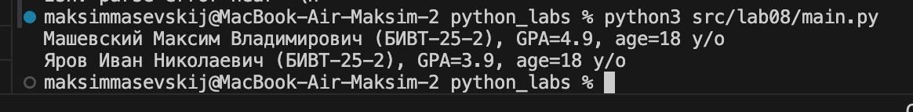
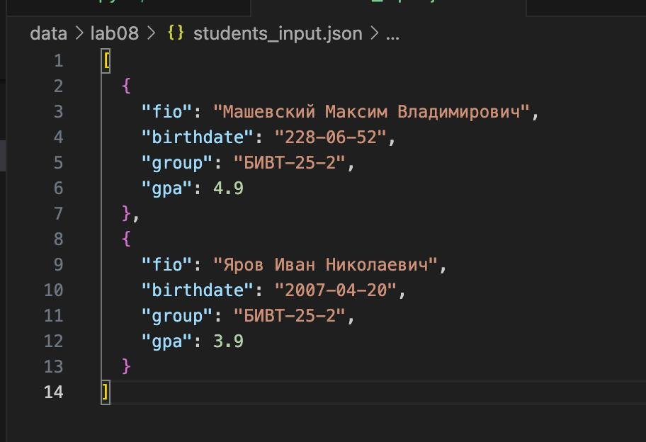
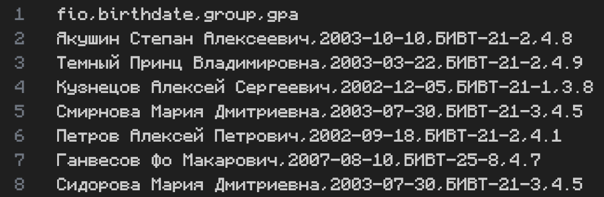
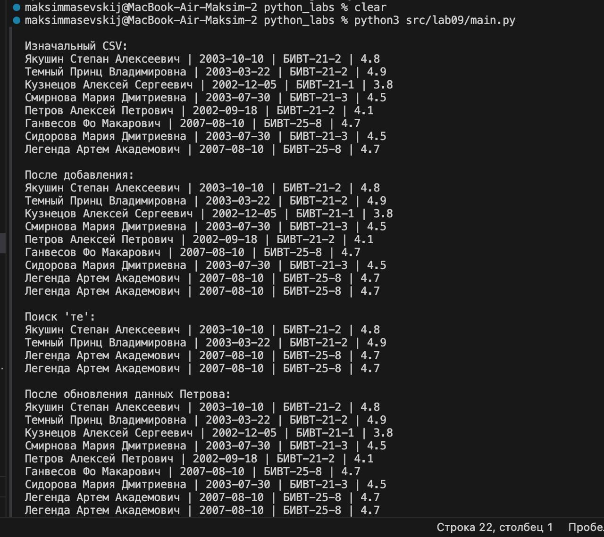
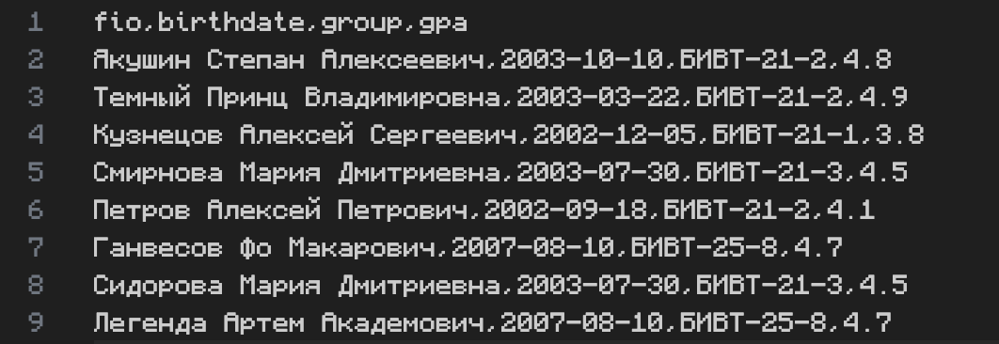

# Лабораторная работа №8
## Задание A
### Описание: Данный код реализует класс Student для хранения данных о студенте: ФИО, дату рождения, группу и средний балл (GPA). Класс автоматически проверяет корректность формата даты и значения GPA при создании объекта, предоставляет методы для вычисления возраста, преобразования в словарь и обратно, а также удобного строкового представления.

```bash
@dataclass
class Student:
    fio: str
    birthdate: str   # формат YYYY-MM-DD
    group: str
    gpa: float       # 0..5

    def __post_init__(self):
        # Проверка формата даты
        try:
            datetime.strptime(self.birthdate, "%Y-%m-%d")
        except ValueError:
            raise ValueError(f"Invalid birthdate format: {self.birthdate}. Expected YYYY-MM-DD")

        # Проверка диапазона GPA
        if not (0 <= self.gpa <= 5):
            raise ValueError("GPA must be between 0 and 5")

    def age(self) -> int:
        """Возвращает количество полных лет."""
        bdate = datetime.strptime(self.birthdate, "%Y-%m-%d").date()
        today = date.today()
        years = today.year - bdate.year
        if (today.month, today.day) < (bdate.month, bdate.day):
            years -= 1
        return years

    def to_dict(self) -> dict:
        """Сериализация в словарь."""
        return {
            "fio": self.fio,
            "birthdate": self.birthdate,
            "group": self.group,
            "gpa": self.gpa,
        }

    @classmethod
    def from_dict(cls, data: dict) -> "Student":
        """Создание объекта из словаря."""
        return cls(
            fio=data["fio"],
            birthdate=data["birthdate"],
            group=data["group"],
            gpa=float(data["gpa"]),
        )

    def __str__(self):
        return f"{self.fio} ({self.group}), GPA={self.gpa}, age={self.age()} y/o"

```
## Задание B
### Описание: Функция students_to_json сохраняет список объектов Student в JSON-файл, предварительно преобразуя каждый объект в словарь. Функция students_from_json загружает данные из JSON-файла и восстанавливает из них список объектов Student.
```bash
def students_to_json(students, path):
    """Сохраняет список студентов в JSON-файл."""
    data = [s.to_dict() for s in students]
    with open(path, "w", encoding="utf-8") as f:
        json.dump(data, f, ensure_ascii=False, indent=2)


def students_from_json(path):
    """Загружает список студентов из JSON-файла."""
    with open(path, "r", encoding="utf-8") as f:
        raw = json.load(f)
    return [Student.from_dict(item) for item in raw]
```
## Запуск main.py

## Файл student_output.json



# ЛР9 — «База данных» на CSV: класс Group, CRUD-операции и CLI
## Задание A - Реализовать класс Group
### Описание: Данный код реализует класс Group для управления списком студентов, хранящимся в CSV-файле. Класс обеспечивает базовые операции CRUD (создание, чтение, обновление, удаление) с записями о студентах, используя модель Student из модуля models.
## Код(Реализация класса Group):
```bash
import csv
from pathlib import Path
from src.lab08.models import Student


class Group:
    HEADER = ["fio", "birthdate", "group", "gpa"]

    def __init__(self, storage_path):
        self.path = Path(storage_path)
        self._ensure_storage_exists()

    def _ensure_storage_exists(self):
        if not self.path.exists():
            with self.path.open("w", encoding="utf-8", newline="") as f:
                writer = csv.writer(f)
                writer.writerow(self.HEADER)

    def _read_all(self):
        students = []
        with self.path.open("r", encoding="utf-8") as f:
            reader = csv.DictReader(f)
            for row in reader:
                students.append(
                    Student(
                        fio=row["fio"],
                        birthdate=row["birthdate"],
                        group=row["group"],
                        gpa=float(row["gpa"]),
                    )
                )
        return students

    def list(self):
        return self._read_all()

    def add(self, student):
        with self.path.open("a", newline="", encoding="utf-8") as f:
            writer = csv.writer(f)
            writer.writerow(
                [student.fio, student.birthdate, student.group, student.gpa]
            )

    def find(self, substr):
        substr = substr.lower()
        return [s for s in self._read_all() if substr in s.fio.lower()]

    def remove(self, fio):
        students = self._read_all()
        students = [s for s in students if s.fio != fio]

        with self.path.open("w", newline="", encoding="utf-8") as f:
            writer = csv.writer(f)
            writer.writerow(self.HEADER)
            for s in students:
                writer.writerow([s.fio, s.birthdate, s.group, s.gpa])

    def update(self, fio: str, **fields):
        students = self._read_all()

        for student in students:
            if student.fio == fio:
                for key, value in fields.items():
                    setattr(student, key, value)
                break

        with self.path.open("w", newline="", encoding="utf-8") as f:
            writer = csv.writer(f)
            writer.writerow(self.HEADER)
            for st in students:
                writer.writerow([st.fio, st.birthdate, st.group, st.gpa])

```
## Файл CSV до тестов:

## Тесты(вывод в консоли):

## Файл CSV после тестов:
