<h1>Python_Labs</h1>

# Лабораторная работа 1
### Задание 1:

Программа выводит простое приветствие в консоль.
```python
name = input()
age =int(input())
age1 = age +1
print('Имя:',name)
print('Возраст:',age)
print(f'Привет, {name}! Через год тебе будет {age1} лет.')
```
Результат выполнения:

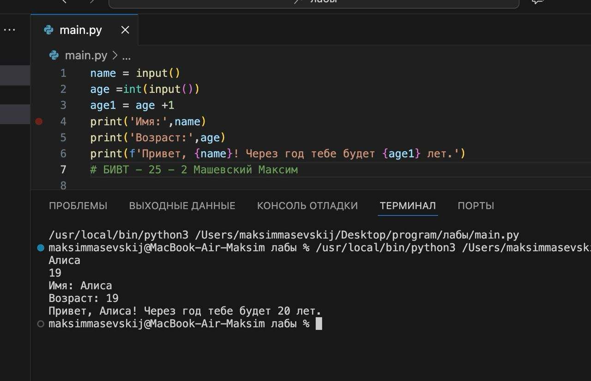

### Задание 2: 

```python
a = (input("a: ")).replace(",",".")
b = (input("b: ")).replace(",",".")
print(f"sum={round(float(a)+float(b), 2)}; avg={round((float(a)+float(b))/2, 2)}")
```
Результат выполнения:

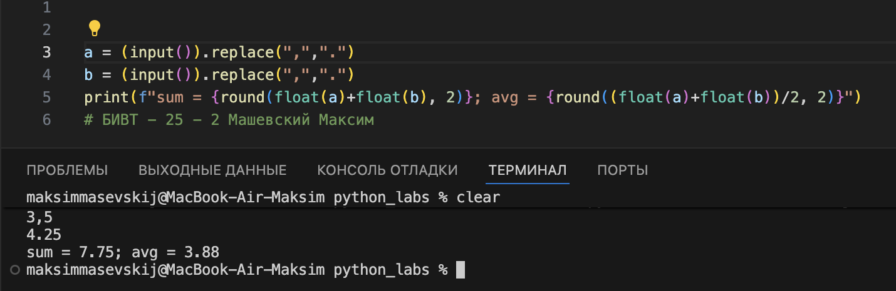

### Задание 3: 
```python

price = int(input())
discount = int(input())
vat = int(input())
base = price * (1 - discount/100)
vat_amount = base * (vat/100)
total = base + vat_amount
print(f"База после скидки: {base:.2f} ₽")
print(f"НДС:               {vat_amount:.2f} ₽")
print(f"Итого к оплате:    {total:.2f} ₽")
```
Результат выполнения:

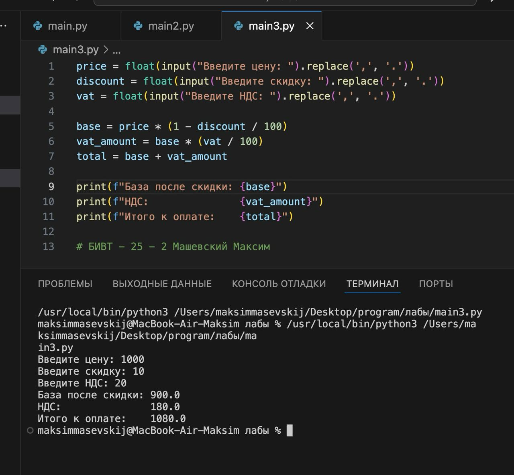

### Задание 4: 
```python

m = int(input())
h = m//60
print(f"{h}:{(m-60*h):02d}")
```
Результат выполнения:

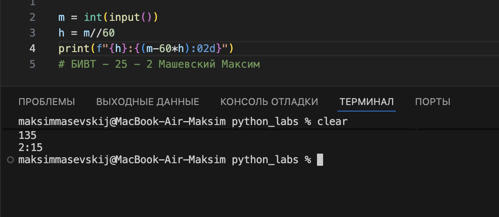

### Задание 5:
```python
f = input("ФИО: ")
fio = f.strip()
c = fio.split()
с1 =  sum(len(w) for w in c)
i = "".join(p[0].upper() for p in c) + "."
print("Инициалы:", i)
print("Длина (символов):",с1+2)
```
Результат выполнения:

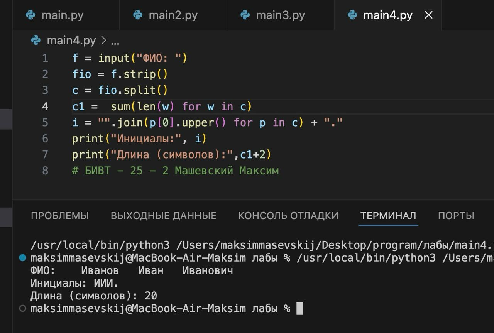

# Лабораторная работа 2
### Задание 1:

```python
def mnmx(nums: list[float | int]):
    if not nums:  
        print('Value Error')
        return None  
    mn = min(nums)
    mx = max(nums)
    return (mn, mx)
    
def unique_sorted (nums: list[float | int]):
    return list( sorted( set(nums)))

def flatten(mat: list[list | tuple]):
    flattened_list = []
    for row in mat:
        if isinstance(row, (list, tuple)):
            flattened_list.extend(row)
        else:
            raise TypeError
    return flattened_list
```
Результат выполнения:

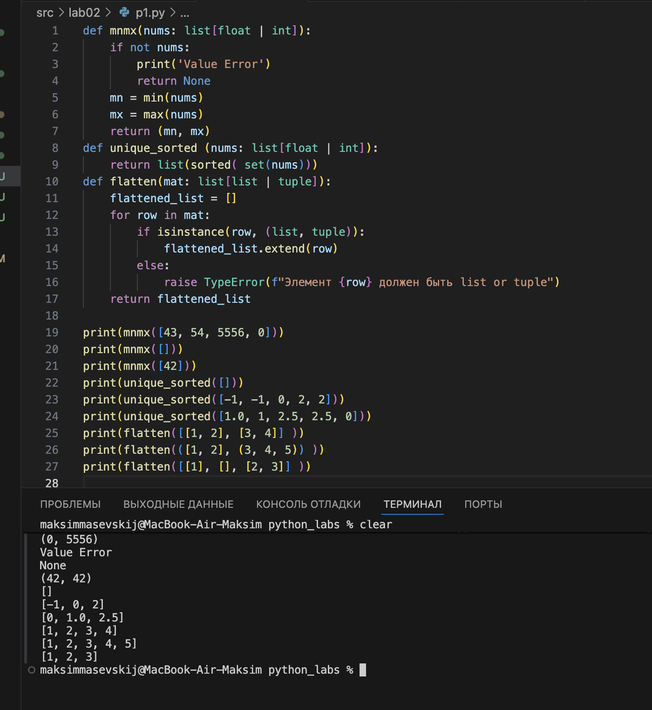

### Задание 2:
```python
def transpose(mat: list[list[float | int]]):
    if not mat:
        return []
    rows = len(mat)
    cols = len(mat[0])
    for row in mat:
        if len(row)!=cols:
            raise ValueError
    teleport_mat = [[mat[i][j] for i in range(rows)] for j in range(cols)]
    return teleport_mat
print(transpose([[1, 2, 3]]))
print(transpose([[1],[2], [3]]))
print(transpose([[1,2],[3,4]]))
print(transpose([[1,2],[3]]))
print(transpose([[]]))

def row_sums(mat: list[list[float | int]]):
    if not mat:
        return []
    rows = len(mat)
    cols = len(mat[0])
    for row in mat:
        if len(row) != cols:
            raise ValueError
    sums=[sum(row) for row in mat]
    return sums
print(row_sums([[1,2,3], [4,5,6]]))
print(row_sums([[-1, 1], [10, -10]]))
print(row_sums([[0,0], [0,0]]))
print(row_sums([[1,2], [3]])) 

def col_sums(mat: list[list[float | int]]):
    if not mat:
        return []
    rows = len(mat)
    cols = len(mat[0])
    for row in mat:
        if len(row) != cols:
            raise ValueError     
    sums = []
    for j in range(cols):
        column_sum = 0
        for i in range(rows):
            column_sum += mat[i][j]
        sums.append(column_sum)    
    return sums

print(col_sums([[1, 2, 3], [4, 5, 6]]))  
print(col_sums([[-1, 1], [10, -10]]))    
print(col_sums([[0, 0], [0, 0]]))        
print(col_sums([[1, 2], [3]]))  
```
Результат выполнения:

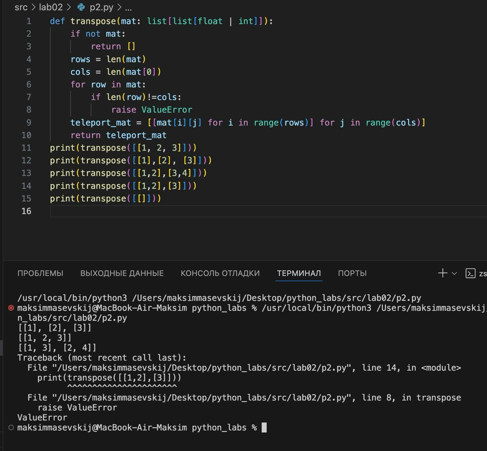
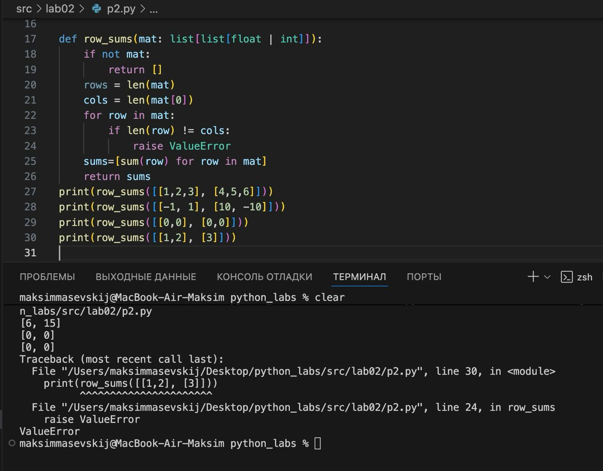
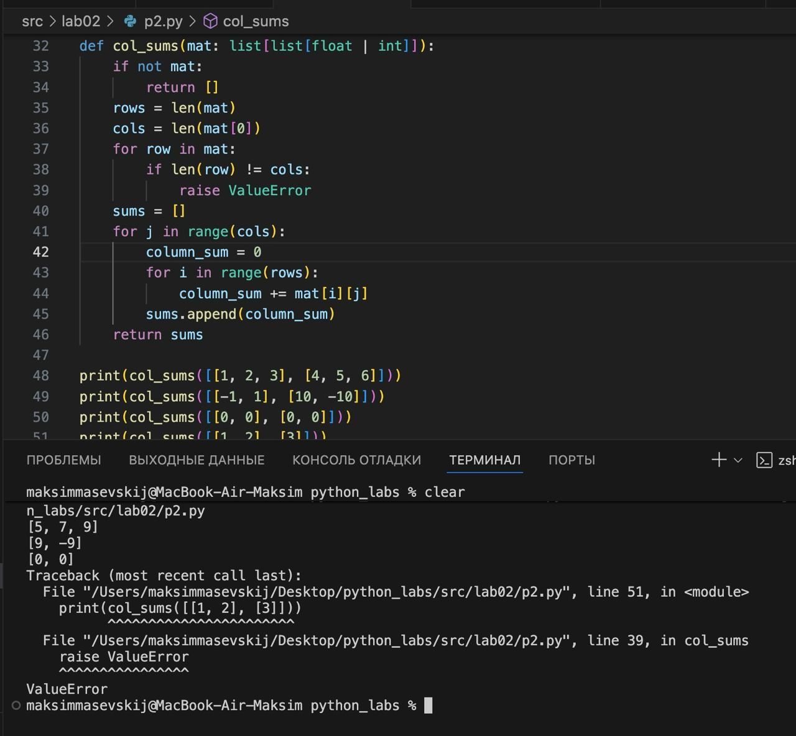


### Задание 3:
```python
def format_record(rec: tuple[str, str, float]):
    if not isinstance(rec, tuple):
        raise TypeError(f"Ожидается tuple, получен {type(rec).__name__}")
    if len(rec) != 3:
        raise ValueError(f"Ожидается кортеж из 3 элементов, получено {len(rec)}")
    fio, group, gpa = rec
    if not isinstance(fio, str):
        raise TypeError(f"ФИО должен быть строкой, получен {type(fio).__name__}")
    if not isinstance(group, str):
        raise TypeError(f"Группа должна быть строкой, получен {type(group).__name__}")
    if not isinstance(gpa, (int, float)):
        raise TypeError(f"GPA должен быть числом, получен {type(gpa).__name__}")
    if gpa < 0 or gpa > 5:
        raise ValueError(f"GPA должен быть в диапазоне от 0 до 5, получено {gpa}")
    parts = fio.strip().split()
    family = parts[0]
    initials = ""
    for part in parts[1:]:
        initials += part[0].upper() + "."
    if not initials:
        initials = ""
    form_gpa = f"{gpa:.2f}"
    return f"{family} {initials}, гр. {group}, GPA {form_gpa}"

print(format_record(("Иванов Иван Иванович", "BIVT-25", 4.6)))
print(format_record(("Петров Пётр", "IKBO-12", 5.0)))
print(format_record(("Петров Пётр Петрович", "IKBO-12", 5.0)))
print(format_record(("  сидорова  анна   сергеевна ", "ABB-01", 3.999)))
```
Результат выполнения:

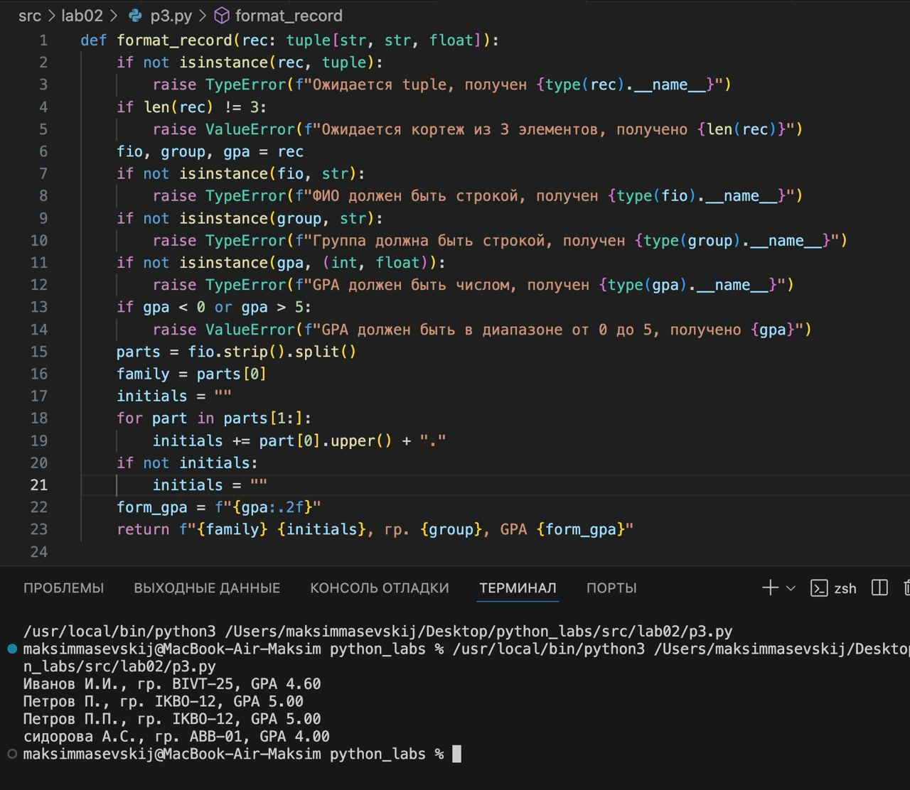

# Лабораторная работа 3
### Задание 1:
```python
import re
def normalize(text: str, *, casefold: bool = True, yo2e: bool = True) -> str:
    result = text
    if casefold == True:
        result = result.casefold()    
    if yo2e == True:
        result = result.replace('ё', 'е').replace('Ё', 'е')
    for char in ['\t', '\r', '\n']:
        result = result.replace(char, ' ')
    result = re.sub(r'\s+', ' ', result).strip()
    return result

def tokenize(text: str) -> list[str]:
    pattern = r'\w+(?:-\w+)*'
    tokens = re.findall(pattern, text)
    return tokens

def count_freq(tokens: list[str]) -> dict[str, int]:
    frequency_dict = {}
    for token in tokens:
        frequency_dict[token] = frequency_dict.get(token, 0) + 1
    return frequency_dict

def top_n(freq: dict[str, int], n: int = 5) -> list[tuple[str, int]]:
    items = list(freq.items())
    sorted_items = sorted(items, key=lambda x: (-x[1], x[0]))
    return sorted_items[:n]

# print(normalize("ПрИвЕт\nМИр\t"))
# print(normalize("ёжик, Ёлка")) 
# print(normalize("Hello\r\nWorld"))
# print(normalize("  двойные   пробелы  "))

# print(tokenize("привет мир" ))
# print(tokenize("hello,world!!!"))
# print(tokenize("по-настоящему круто"))
# print(tokenize("2025 год" ))
# print(tokenize("emoji 😀 не слово" ))

# print(count_freq(["a","b","a","c","b","a"]))
# print(count_freq(["bb", "aa", "bb", "aa", "cc"]))

# freq1 = {"a": 3, "b": 2, "c": 1}
# print(top_n(freq1, 2))
# freq2 = {"bb": 2, "aa": 2, "cc": 1}
# print(top_n(freq2, 2))
```
Результат выполнения:

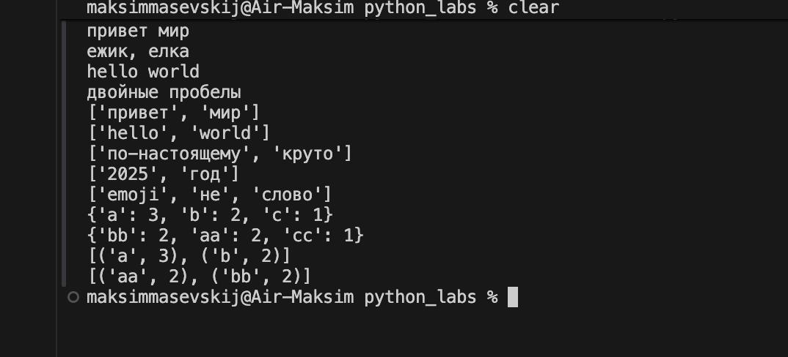
### Задание 2:
```python
import sys
import os

sys.path.append(os.path.join(os.path.dirname(__file__), '..'))

from lib.pt1 import normalize, tokenize, count_freq, top_n

def main() -> None:
    text = sys.stdin.read().strip()

    norm = normalize(text)
    tokens = tokenize(norm)
    freq = count_freq(tokens)

    print(f"Всего слов: {len(tokens)}")
    print(f"Уникальных слов: {len(freq)}")
    print("Топ-5:")
    for word, count in top_n(freq, 5):
        print(f"{word}:{count}")

if __name__ == "__main__":
    main()

"""
1. Сначала вставляешь в терминал  python3 src/lab03/text_stats.py
2. Затем втсавляешь текст, то есть Привет, мир! Привет!!!
3. Потом клавишами CTRL+D
"""
```
Результат выполнения:


# Лабораторная работа 4
### Задание A:
### io_txt_csv
```python
from csv import writer
from pathlib import Path

def read_text(path: str, encoding: str = "utf-8") -> str:
    return Path(path).read_text(encoding=encoding)

def write_csv(rows: list, path: str, header: tuple = None) -> None:
    Path(path).parent.mkdir(parents=True, exist_ok=True)
    
    with open(path, 'w', newline='', encoding='utf-8') as f:
        w = writer(f)
        if header:
            w.writerow(header)
        w.writerows(rows)
```

### Задание B
### text_report
```python
import sys
from pathlib import Path

sys.path.insert(0, str(Path(__file__).parent.parent))

from lab04.io_txt_csv import read_text, write_csv
from lib.pt1 import normalize, tokenize, count_freq, top_n

def validate_output_file(filename):
    path = Path(filename)
    if path.suffix.lower() != '.csv':
        raise ValueError()

def main():
    input_file = "src/data/lab04/input.txt"  
    output_file = "src/data/lab04/report.csv"  
    
    try:
        # Проверка типа выходного файла
        validate_output_file(output_file)
        
        text = read_text(input_file)
        freq = count_freq(tokenize(normalize(text)))
        write_csv(sorted(freq.items(), key=lambda x: (-x[1], x[0])), 
                 output_file, header=("word", "count"))
        
        print(f"✓ Отчёт сохранён: {output_file}")
        print(f"Всего слов: {sum(freq.values())}")
        print(f"Уникальных слов: {len(freq)}")
        print("Топ-5:", *[f"{w}:{c}" for w, c in top_n(freq, 5)])
        
    except FileNotFoundError:
        print(f"✗ Файл {input_file} не найден")
        sys.exit(1)
    except ValueError as e:
        print(f"✗ Ошибка валидации: {e}")
        sys.exit(1)
    except Exception as e:
        print(f"✗ Ошибка: {e}")
        sys.exit(1)

if __name__ == "__main__":
    main()
```
Результат выполнения:

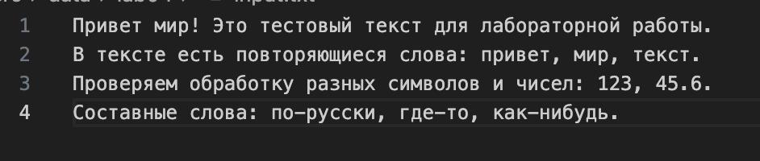
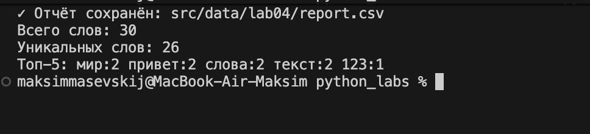
